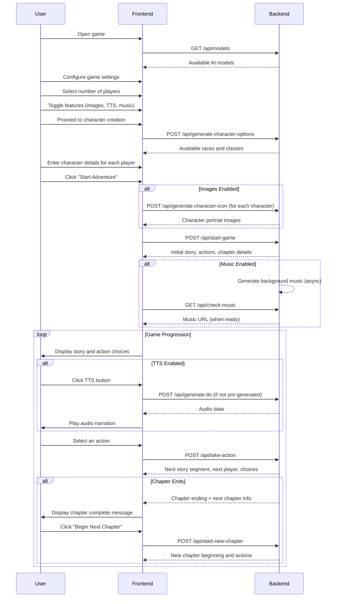
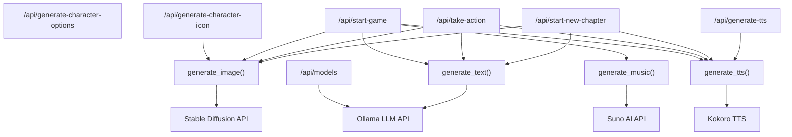

# D&D AI Adventure - API Communication Flow

This document explains how the frontend React application communicates with the backend FastAPI server during a typical game progression.

## API Endpoint Overview

| Endpoint | Method | Purpose |
|----------|--------|---------|
| `/api/models` | GET | Retrieve available AI models |
| `/api/generate-character-options` | POST | Get available races and classes |
| `/api/generate-character-icon` | POST | Generate character portraits |
| `/api/start-game` | POST | Initialize game with first story segment |
| `/api/take-action` | POST | Process player actions and continue story |
| `/api/start-new-chapter` | POST | Begin a new chapter after completing one |
| `/api/check-music` | GET | Check status of background music generation |
| `/api/generate-tts` | POST | Generate text-to-speech narration |

## Game Flow Sequence Diagram

## Detailed API Flow

### 1. Game Setup

- The frontend first retrieves available AI models (`GET /api/models`)
- The user configures game settings, including player count, AI model, and whether to enable features like images, TTS, and music
- After setup, the app transitions to character creation

### 2. Character Creation

- The frontend requests available races and classes (`POST /api/generate-character-options`)
- The user enters details for each character (name, race, class, gender)
- When "Start Adventure" is clicked, if image generation is enabled, the app requests character portraits (`POST /api/generate-character-icon`)

### 3. Game Start

- The frontend sends the game state to initialize the adventure (`POST /api/start-game`)
- The backend generates the initial story segment, action choices, and chapter info
- If music is enabled, the backend begins asynchronous music generation, and the frontend periodically checks for it (`GET /api/check-music`)

### 4. Game Loop

- For each turn:
  - The frontend displays the current story and action choices
  - If TTS is enabled, the user can click to hear narration
  - When the user selects an action, the frontend sends it to the backend (`POST /api/take-action`)
  - The backend generates the next story segment and returns it to the frontend
  - The process repeats for each player in rotation

### 5. Chapter Transitions

- After a certain number of rounds (typically 3), a chapter ends
- The backend includes chapter ending information and next chapter details in the response
- The frontend displays a "Chapter Complete" message and a button to start the next chapter
- When clicked, the frontend requests the new chapter (`POST /api/start-new-chapter`)
- The backend generates the beginning of the next chapter and returns it

## Data Flow for TTS

1. If AI TTS is enabled in settings (`enableAITTS`):
   - The backend pre-generates TTS for new story segments and includes it in the response as `audioData`
   - The frontend plays this audio when requested
   - For older segments without pre-generated audio, the frontend can request it on-demand (`POST /api/generate-tts`)

2. If AI TTS is disabled:
   - The frontend falls back to using the browser's built-in `speechSynthesis` API

## Backend Endpoint to AI Service Interaction

The backend endpoints interact with various AI services to generate content for the game. Here's how each endpoint utilizes these services:

### Endpoint to AI Service Mapping:

1. **`/api/generate-character-options`**:
   - Primarily uses internal logic, not heavily dependent on AI services

2. **`/api/generate-character-icon`**:
   - Uses `generate_image()` to create character portraits
   - Passes a prompt describing the character's race, class, and gender

3. **`/api/start-game`**:
   - Uses `generate_text()` to create initial story and chapter title
   - Uses `generate_image()` to create scene images (if enabled)
   - Uses `generate_music()` asynchronously for background music (if enabled)
   - Uses `generate_tts()` to pre-generate narration audio (if enabled)

4. **`/api/take-action`**:
   - Uses `generate_text()` to continue story based on player actions
   - Uses `generate_image()` for scene updates (if enabled)
   - Uses `generate_tts()` for narration (if enabled)

5. **`/api/start-new-chapter`**:
   - Uses `generate_text()` to create new chapter opening
   - Uses `generate_image()` for chapter illustration (if enabled)
   - Uses `generate_tts()` for narration (if enabled)

6. **`/api/generate-tts`**:
   - Directly calls `generate_tts()` for on-demand audio generation

7. **`/api/models`**:
   - Queries Ollama API directly to get available models

### AI Services:

1. **`generate_text()`**:
   - Makes requests to Ollama API with carefully crafted prompts
   - Handles prompt engineering and formatting instructions
   - Returns generated text content

2. **`generate_image()`**:
   - Communicates with Stable Diffusion API
   - Enhances prompts with D&D-themed descriptions
   - Returns base64-encoded image data

3. **`generate_music()`**:
   - Makes API calls to Suno AI
   - Returns URL to generated background music

4. **`generate_tts()`**:
   - Uses Kokoro TTS pipeline to generate speech audio
   - Processes text in sentence chunks for natural speech
   - Returns base64-encoded audio data

This sequence ensures a seamless game experience where the AI-generated content (text, images, audio) is delivered to the player at the appropriate moments throughout their adventure.
